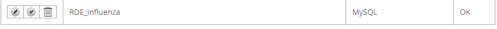

# Doses Distribution  

## Introduction  

This repository is dedicated to the doses distribution page which is a part of the rde-systems influenza website project. In this readme file you will find useful documentation and information about this page.  

## SETTING UP 

### Step 1: Setting up the environment  

Setting up the ColdFusion environment is fairly straight forward:  

- Make sure you have the latest Java JDK installed
- Set up the correct PATH for JAVA_HOME in your environment variables
- Download ColdFusion from Adobe Website
- Install the server with the ColdFusion Builder extension on VScode

### Step 2: API setup

- Create an Account on : https://evergreen.data.socrata.com/
- Create an App Token
- Connect Using:  

```
<cfhttp method = "GET" url = "#apiEndPoint#?" result = "httpResponse">
    <cfhttpparam type = "header" name = "X-App-Token" value = "MYKEY">
</cfhttp>
 ```

Note: apiEndPoint var should be your respective data endpoint from the cdc website

### Step 3: DB setup  

- Install mysql-connector drivers available [HERE](https://dev.mysql.com/downloads/connector/j/)
- Extract the jar into the `cfusion/lib` folder
- Restart the server
- Create a MYSQL server on MYSQL workbench (version < 8 preferred) 
- Add the database through the CF admin panel 
- Test the connection, if everything is set up correctly "OK" should be display on the admin dashboard when testing the connection 
